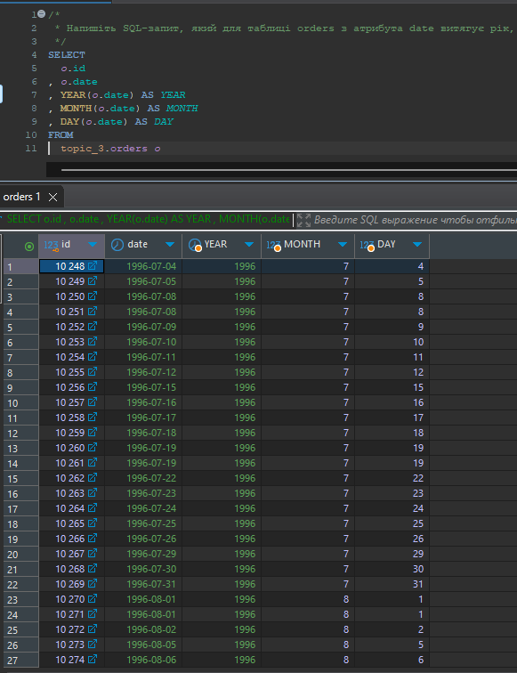
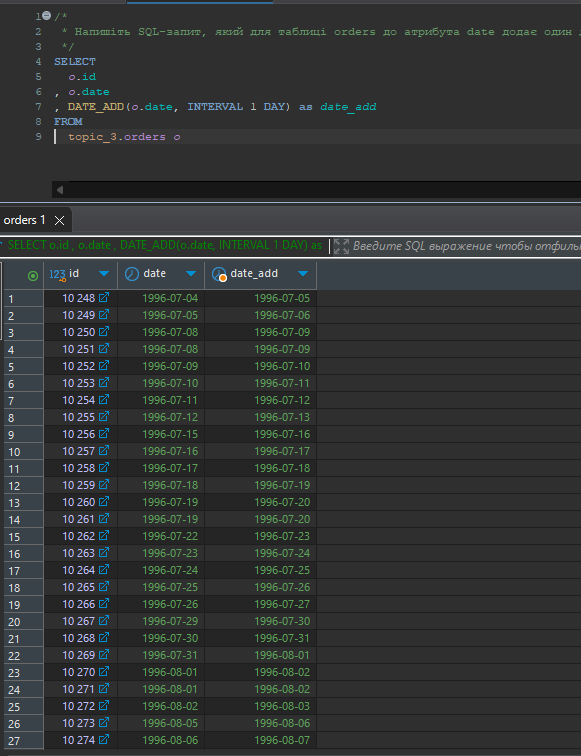
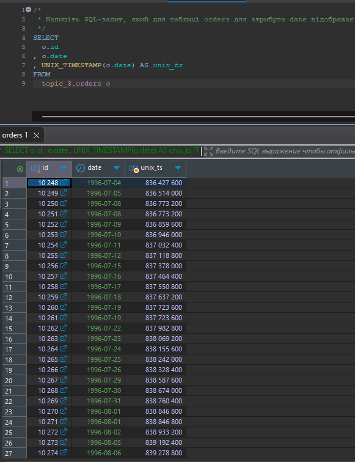
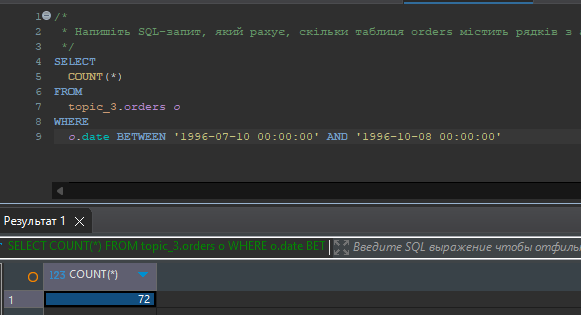
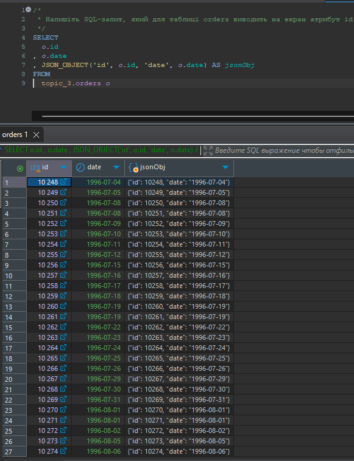

# goit-rdb-hw-07. Додаткові вбудовані SQL функції. Робота з часом

## Завдання 1

1\. Напишіть SQL-запит, який для таблиці `orders` з атрибута `date` витягує рік, місяць і число. Виведіть на екран їх у три окремі атрибути поряд з атрибутом `id` та оригінальним атрибутом `date` (всього вийде 5 атрибутів).

---

### Рішення 1

SQL-код: [p1.sql](p1.sql)

Скрін результату

## Завдання 2

2\. Напишіть SQL-запит, який для таблиці `orders` до атрибута `date` додає один день. На екран виведіть атрибут `id`, оригінальний атрибут `date` та результат додавання.

---

### Рішення 2

SQL-код: [p2.sql](p2.sql)

Скрін результату

---

## Завдання 3

3\. Напишіть SQL-запит, який для таблиці `orders` для атрибута `date` відображає кількість секунд з початку відліку (показує його значення timestamp). Для цього потрібно знайти та застосувати необхідну функцію. На екран виведіть атрибут `id`, оригінальний атрибут `date` та результат роботи функції.

### Рішення 3

SQL-код: [p3.sql](p3.sql)

Скрін результату

---

## Завдання 4

4\. Напишіть SQL-запит, який рахує, скільки таблиця `orders` містить рядків з атрибутом `date` у межах  
між `1996-07-10 00:00:00` та `1996-10-08 00:00:00`.

### Рішення 4

SQL-код: [p4.sql](p4.sql)

Скрін результату

## 

## Завдання 5

5\. Напишіть SQL-запит, який для таблиці `orders` виводить на екран атрибут `id`, атрибут `date` та JSON-об’єкт `{"id": <атрибут id рядка>, "date": <атрибут date рядка>}`. Для створення JSON-об’єкта використайте функцію.

### Рішення 5

SQL-код: [p5.sql](p5.sql)

Скрін результату

